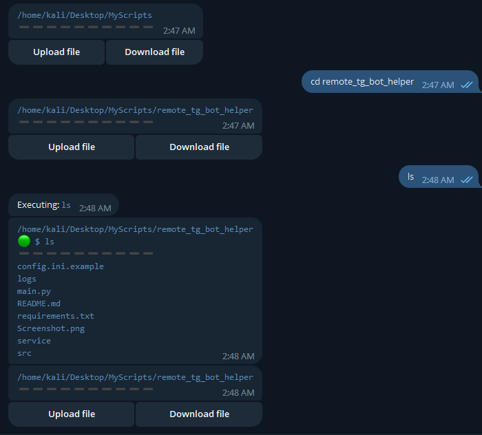

# remote_tg_bot_helper
This bot provides simple interface for remote interact with your system. Bot can be helpful if your system under NAT network.



# Installation

```sh
# Downlaod
git clone https://github.com/3xyz/remote_tg_bot_helper.git
cd remote_tg_bot_helper/
# Install dependencies
pip install -r requirements.txt
# Rename config
mv config.ini.example config.ini
# Creating link into PATH environment folder
ln -s $(pwd)/main.py ~/local/bin/remote_tg_bot_helper
# Setup systemd service
ln -s $(pwd)/service/tg_helper.service /etc/systemd/system/tg_helper.service
sudo systemctl start tg_helper
sudo systemctl enable tg_helper
```

Change bot token and telegram ID inside `config.ini`.

Run scipt by `remote_tg_bot_helper`.
